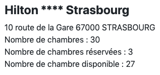
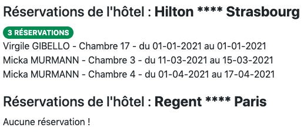
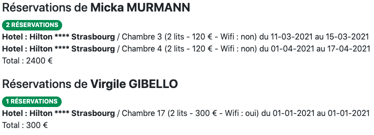
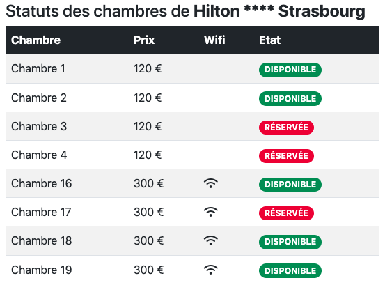

# POO_Hotel

PHP Orienté Object - Exercice Hotel fait à Elan Formation

## Fonctionnalités

Pour cet exercice, il m'a été demander de faire plusieurs fonctions permettant d'afficher :

- Les informations de l'hôtel (adresse, nombres de chambres, ect...)
- Les réservations de l'hôtel
- Les réservations d'un client
- Le status des chambres d'un hôtel

# Le rendu

## Les informations de l'hôtel

## Les réservations de l'hôtel

## Les réservations des clients

## Statut des chambre de l'hôtel

